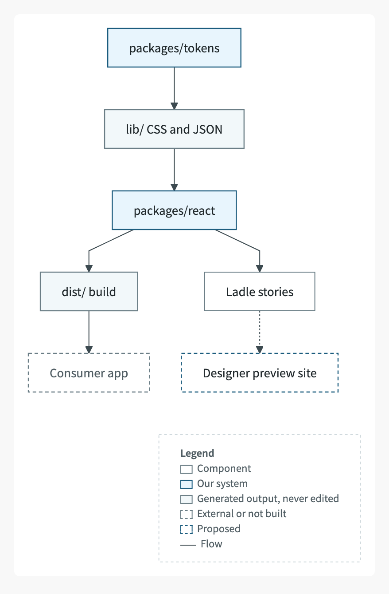
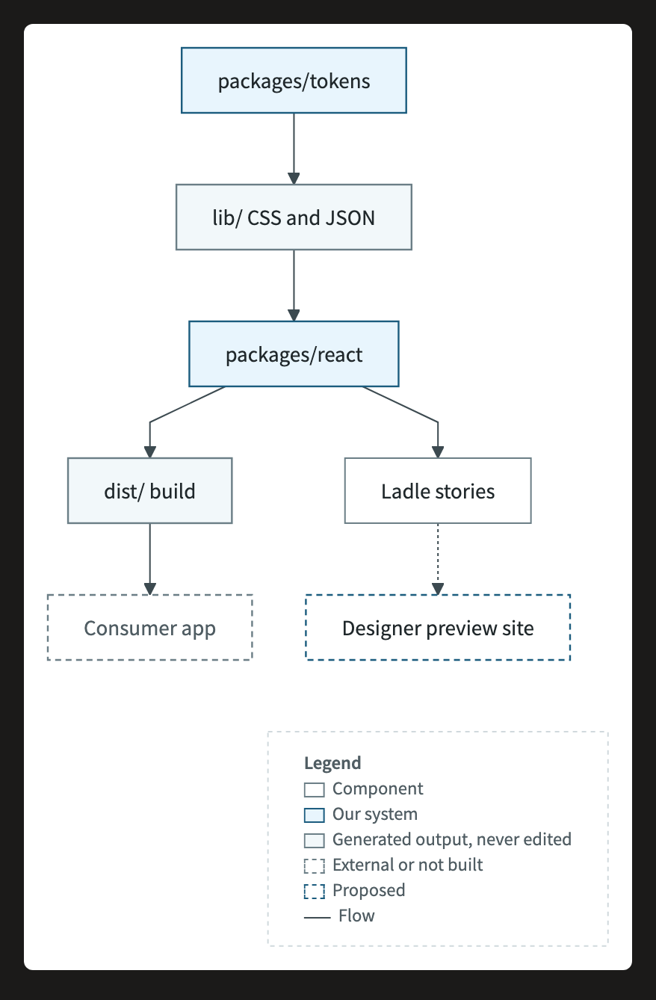
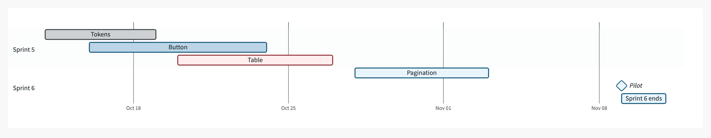
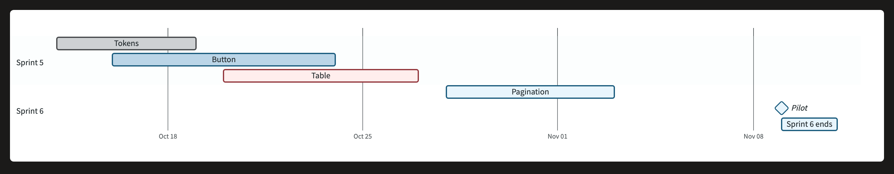

# mermaid-wairo-theme

A calm, Japanese-colour theme for [Mermaid](https://mermaid.js.org) diagrams in documentation. Colour carries meaning
only, every diagram gets a legend, and a strict check refuses anything that breaks the rules. Each chart type is proven
in the Mermaid versions readers actually get.

| Light page | Dark page |
|---|---|
|  |  |
|  |  |

See every supported type, drawn live by GitHub, in [gallery/preview.md](gallery/preview.md).

## Why

Most Mermaid themes recolour the defaults. Documentation needs more than that: the same colour has to mean the same thing
in every diagram, a reader has to be able to decode it, and the result has to survive the viewers it's published to
(SharePoint, GitHub, wikis, PDF), including dark mode. This theme does that with:

- **One palette.** 12 traditional Japanese colours (和色, *wairo*), each calmed: the traditional hue is kept, chroma is
  capped and lightness is set so the colour reads as text on white. Structure has an engineering-drawing tint: 藍白
  (*aijiro*) paper, 藍鼠 (*ainezumi*) borders and iron-grey connectors.
- **Meaning only.** A fixed set of classes and edge kinds, the same in every diagram.
- **Legends, small.** A flowchart gets a key box in its bottom corner. A pie chart keeps its own legend. Every other type
  gets a one-line legend under the diagram.
- **Dark mode.** Every diagram is its own white card with ink text, so it reads the same on a light or a dark page.
- **Proof, not hope.** `tools/build_gallery.py` draws every sample in Mermaid 11.14 (light and dark page) and 12.1 (print),
  and approves a type only if every colour drawn is a palette colour and every label fits its box.

## Quick start

Python 3.9+ (standard library only) for the theme. Node 18+ for the render and check tools.

```python
from wairo import mermaid_theme as T

src = T.theme('''flowchart TD
  api[Orders API]:::ours --> db[(Orders DB)]:::gen
  api --> pay[Payments provider]:::ext
  api --> mail[Email service]:::new
  %% legend: ext = Third-party service
''', edges={1: 'hard'})
T.check(src)    # raises with every rule the diagram breaks
print(src)      # paste into any Mermaid viewer

# or theme every ```mermaid block in a document; adds the one-line legends too
md, count = T.theme_doc(open('design.md').read())
```

`theme()` keeps your content. It adds the init block, the standard `classDef`s, `linkStyle`s for edges that carry meaning
(`edges` maps an edge's index to a kind) and the legend. Running it again on its own output is safe.

### Classes and edge kinds

| Class | Means | Look |
|---|---|---|
| `plain` | a component (the default) | white, indigo-grey border |
| `ours` | our own system, the subject | 藍 indigo |
| `gen` | generated output, an artefact | 藍白 paper |
| `ext` | external, third party, or not real yet | white, dashed grey border, muted text |
| `ok` | done, ready, passing | 常磐 green |
| `warn` | planned, caution, waiting | 朽葉 ochre |
| `block` | hard dependency, gap, failing | 臙脂 crimson |
| `info` | related, context | 青碧 blue-green |
| `risk` | risk, decision, coordination | 江戸紫 purple |
| `new` | proposed, not built | white, dashed indigo border |

| Edge kind | Means | Look |
|---|---|---|
| `flow` | the default arrow | iron grey |
| `hard` | hard dependency | thick crimson |
| `planned` | planned link | dashed ochre |
| `related` | related | fine dashed blue-green |
| `optional` | optional | dotted grey |

Legend wording defaults to the meanings above. Rename an entry, or add one, with a comment in the diagram:
`%% legend: ours = Payments service`, `%% legend: text = each point is one finding`.

### The check

`check(src)` refuses a diagram that has its own colours (a hex value, `rgb()`, a `style` line, its own `classDef`), changes
the theme, uses a class outside the set, has no legend, or is a type the gallery hasn't proven. It also refuses a Gantt
milestone on the chart's last day, because Mermaid then draws the label across the diamond.

## Rules the palette proves

`python3 -m wairo.palette` runs these checks:

- Ink (lines, titles, labels) reads at least 4.5:1 on white. Two large-title colours reach 3.3:1.
- Ink text on a tint reads at least 12:1, and on a soft area at least 7:1. Borders reach at least 3:1.
- Colours that aren't siblings are at least ΔE 25 apart (CIE76). Siblings are at least 12 apart.
- Chroma is capped (OKLCH C ≤ 0.145), so the palette stays calm.

The full table, with every value, is in [gallery/preview.md](gallery/preview.md).

## Type

Noto Sans JP sets Japanese and Latin text in one design, and Noto Sans Mono sets code. This follows the
[Japanese Digital Agency design system](https://design.digital.go.jp/foundations/typography/). Viewers draw diagrams with the
reader's own fonts, so the fallback uses only fonts every machine already has: Segoe UI, Yu Gothic UI and Consolas on
Windows, and Hiragino Sans and Menlo on macOS. Install Noto Sans JP if you want your own renders to match the screenshots.

## Compatibility

| Where | Mermaid | Notes |
|---|---|---|
| SharePoint and other viewers on Mermaid 11 | 11.x (checked on 11.14) | White card in dark mode. Before 11.17, XY charts draw no legend of their own, so they get the one-line legend. |
| PDFs and images | 12.1 via mermaid-cli 12 | Mermaid 12 drops custom CSS, so render on a white page (the tools do). |

Approved types: flowchart, sequence, Gantt, state, class, ER, pie, quadrant, XY chart, mindmap and git graph. Refused,
because Mermaid hard-codes colours no theme setting reaches: journey and timeline (use a Gantt with milestones). Everything
else is refused until a sample is added to the gallery and passes.

## Tools

```sh
npm install                                               # puppeteer-core
npx @puppeteer/browsers install chrome-headless-shell@stable
python3 tools/build_gallery.py                            # prove every type; writes wairo/approved.json, gallery/preview.md
python3 tools/build_doc_pdf.py design.md design.pdf       # Markdown with Mermaid to PDF, diagrams kept as vectors
```

`tools/fetch_mermaid.py` downloads the pinned Mermaid bundles and verifies their SHA-256 (`tools/mermaid-versions.json`).
Set `CHROME_PATH` to use a different Chrome.

## Credits

- Colour names and traditional values: the 和色 tradition. The theme's values are calmed versions of them.
- Typography: the Japanese Digital Agency design system.
- Ideas: an explicit diagram canvas for dark pages, from [Beauty Diagram](https://github.com/beauty-diagram/vscode-beauty-diagram);
  two-colour derivation for themes, from [beautiful-mermaid](https://github.com/lukilabs/beautiful-mermaid).
- [Mermaid](https://github.com/mermaid-js/mermaid), MIT.

## Licence

MIT. See [LICENSE](LICENSE).
