# Wairo theme gallery

Every diagram below uses the same theme, generated from one palette file. Colour only carries meaning, and every diagram carries a legend.

## Flowchart: workspace and packages (top to bottom)

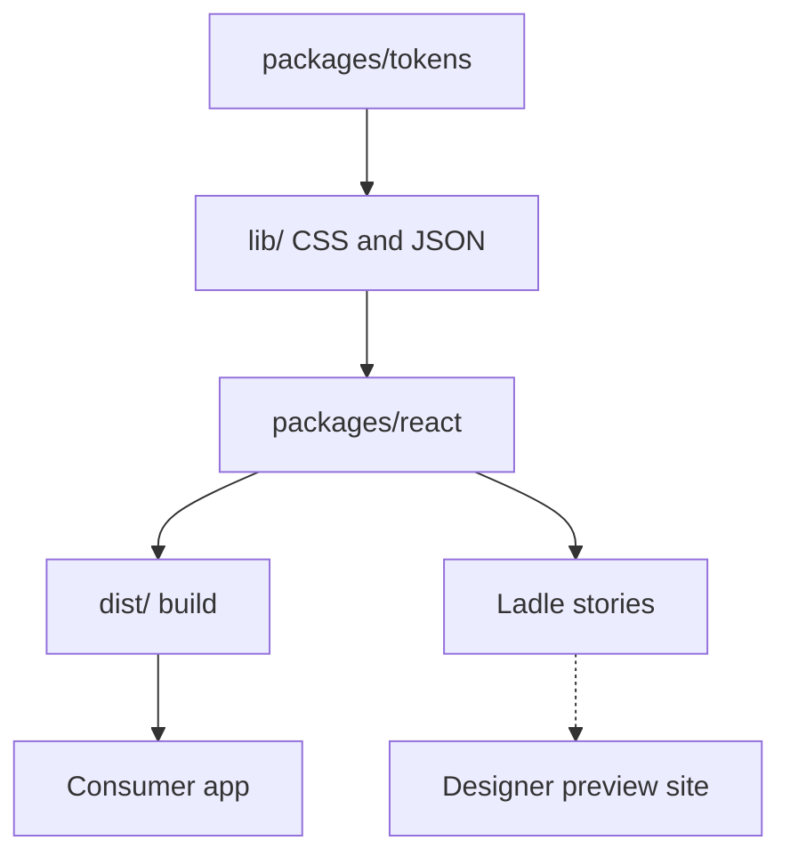

## Flowchart: release critical path (left to right)

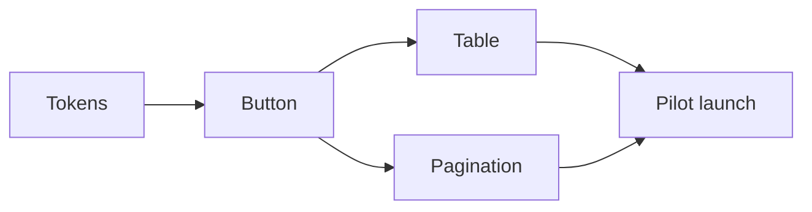

## Sequence: consumer install

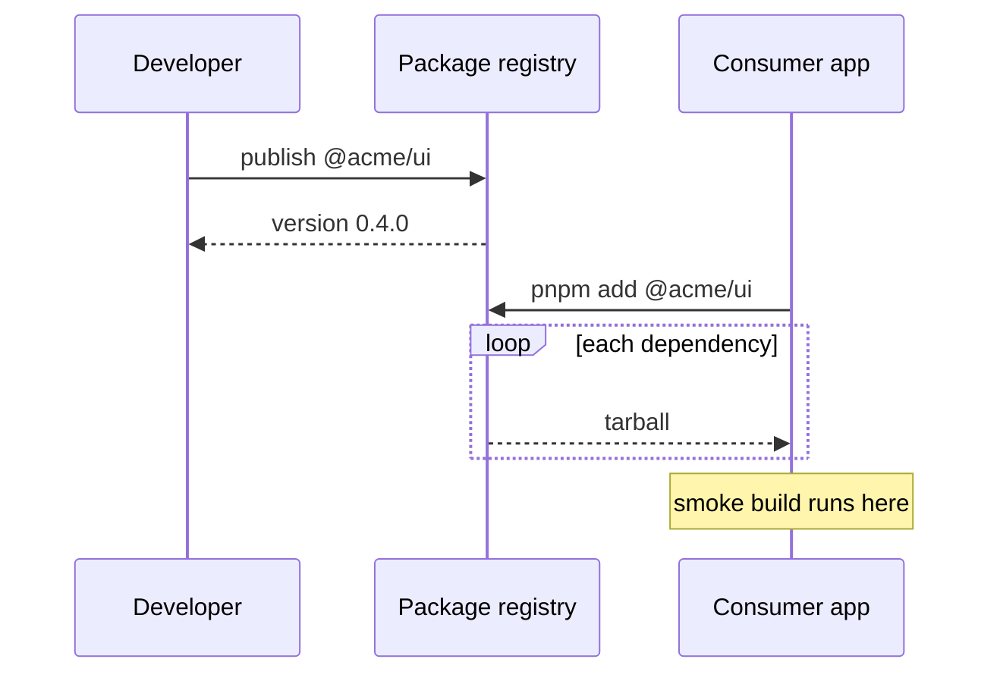

## Gantt: release timeline

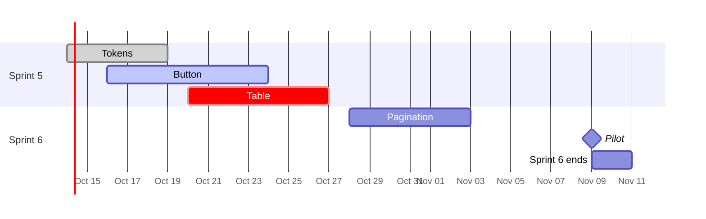

## Pie: test time by area

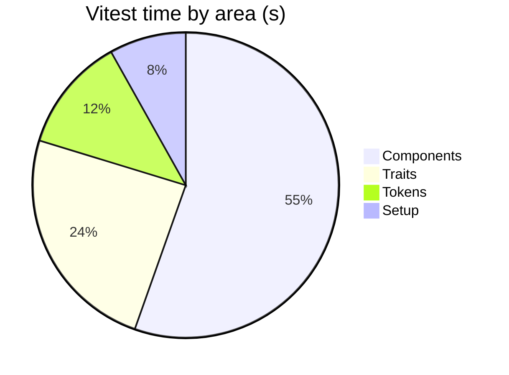

## Quadrant: value and effort

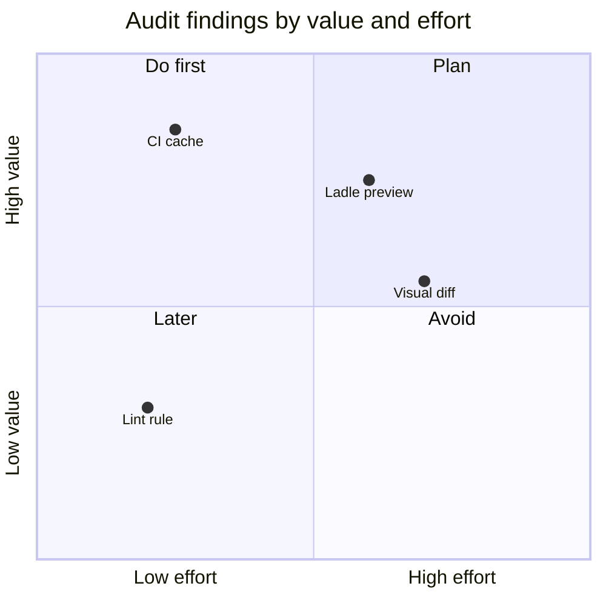

## XY chart: CI step time

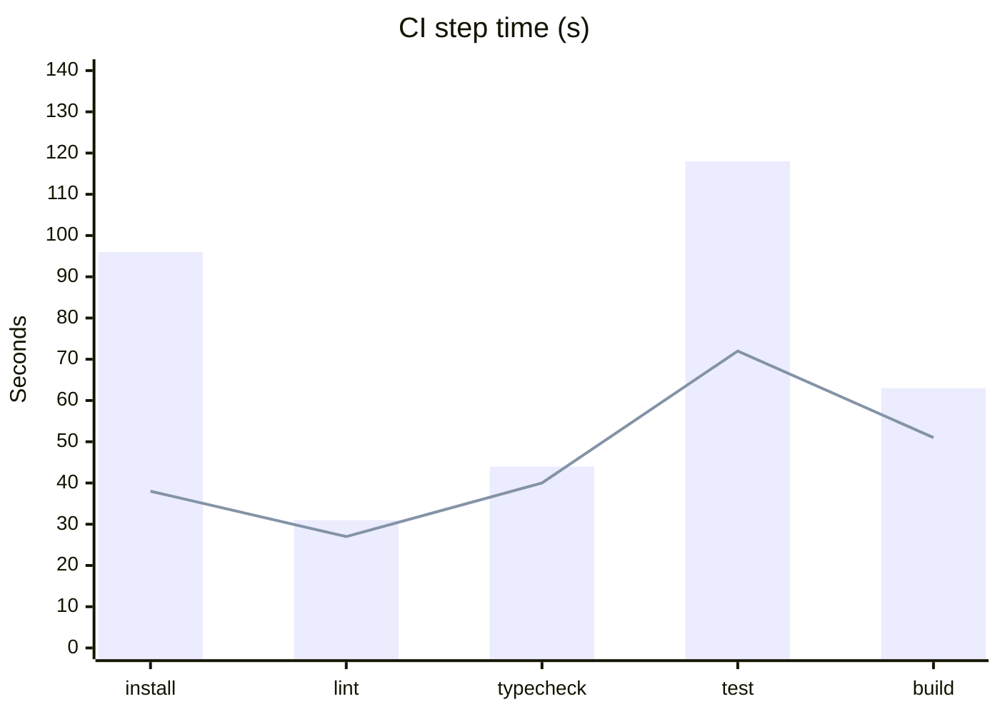

## Mindmap: architecture

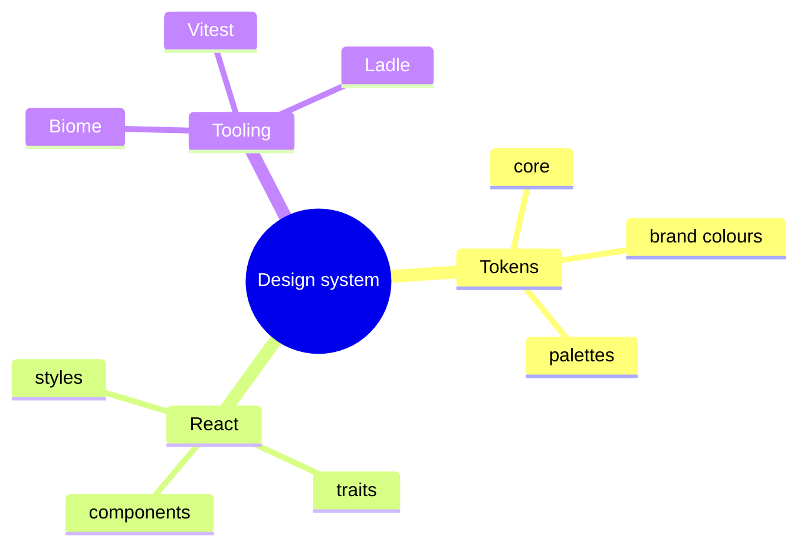

## State: pull request

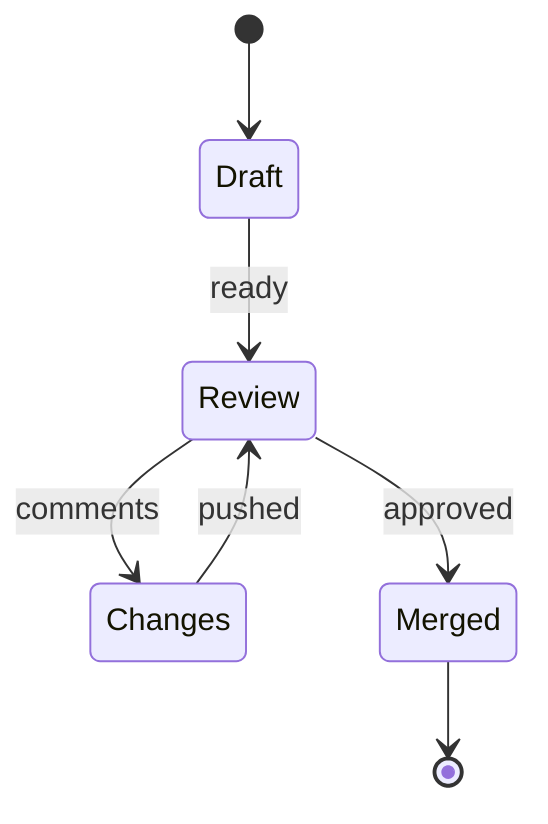

## Class: tokens model

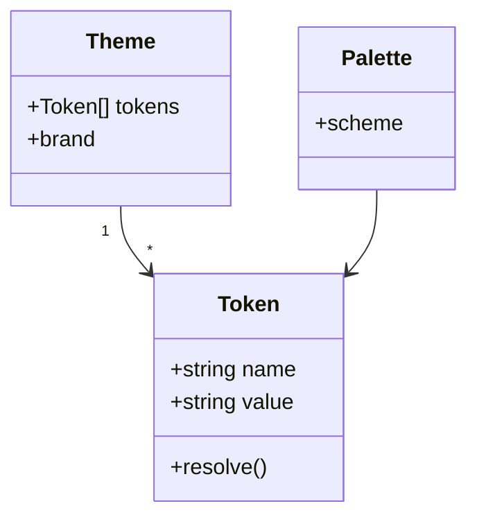

## Entity relationship: releases

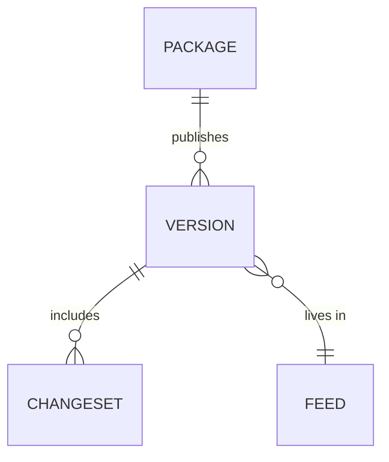

## Git graph: release branch flow

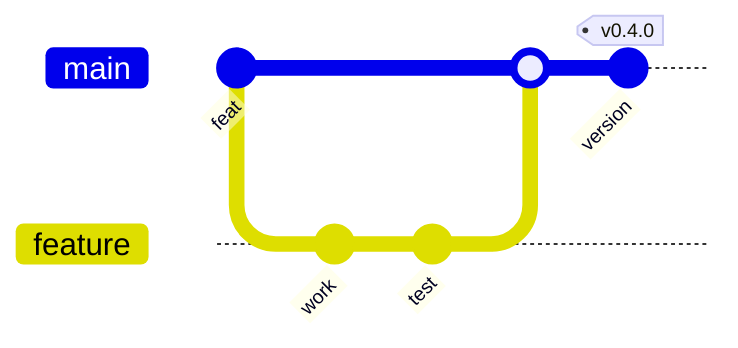
