# Wairo theme gallery

Generated by `tools/build_gallery.py` from `gallery/gallery.src.md`. Every diagram below carries the theme in its own source,
so any Mermaid viewer draws it the same way. Each type here passed every check in Mermaid 11.14.0 on a light
page and a dark page, and in Mermaid 12.1.0 for print, in both the light and the dark theme: every colour drawn is a palette colour, every label fits
inside its box, and the diagram sits on its own white card.

## Palette

| Colour | In words | Ink (lines, titles) | Soft (chart areas) | Tint (box fills) | Used for |
|---|---|---|---|---|---|
| 藍 ai | indigo | `#1B5C7E` | `#BBD5E7` | `#E8F5FD` | class `ours`, "Summary" |
| 紺 kon | navy | `#233C68` | `#C3D2EA` | `#ECF3FF` | "Why" |
| 縹 hanada | light indigo | `#357E9C` | `#B9D6E4` | `#E7F5FC` | "Scope and approach" |
| 青碧 seiheki | blue-green | `#07635D` | `#B6D9D5` | `#E6F7F5` | class `info`, "Evidence" |
| 常磐 tokiwa | green | `#3F7B4A` | `#C1D8C4` | `#EBF6EC` | class `ok`, "Done when" |
| 朽葉 kuchiba | ochre | `#826235` | `#E0CEB7` | `#FAF1E6` | class `warn`, "Out of scope" |
| 臙脂 enji | crimson | `#94373D` | `#E9C8C7` | `#FFEEED` | class `block`, "Depends on" |
| 朱 shu | vermilion | `#B85725` | `#E7CABD` | `#FEEFE9` | "Needs attention", "Risks and decisions" |
| 江戸紫 edomurasaki | purple | `#755A9A` | `#D5CCE6` | `#F4F0FD` | class `risk`, "Findings" |
| 梅紫 umemurasaki | plum | `#A55D81` | `#E5C8D5` | `#FDEEF4` | "Design" |
| 鉄鼠 tetsunezumi | iron grey | `#47494B` | `#CED1D3` | `#F0F3F5` | "Files" |
| 銀鼠 ginnezumi | silver grey | `#7E8182` | `#CED1D3` | `#F0F3F5` | "Links" |

| Neutral | Value |
|---|---|
| ink | `#20282B` |
| rule | `#E2EAED` |
| line | `#CDD9DC` |
| border | `#6C7E84` |
| muted | `#4E5D63` |
| edge | `#3C494E` |
| paper | `#F2F8FA` |
| white | `#FFFFFF` |

Type: Noto Sans JP and Noto Sans Mono, falling back to fonts every machine already has (Segoe UI, Yu Gothic UI and Consolas
on Windows; Hiragino Sans and Menlo on macOS). Diagrams use 13px body text, 11px
legends and 16px titles.

## Diagram types

## Flowchart: workspace and packages (top to bottom)

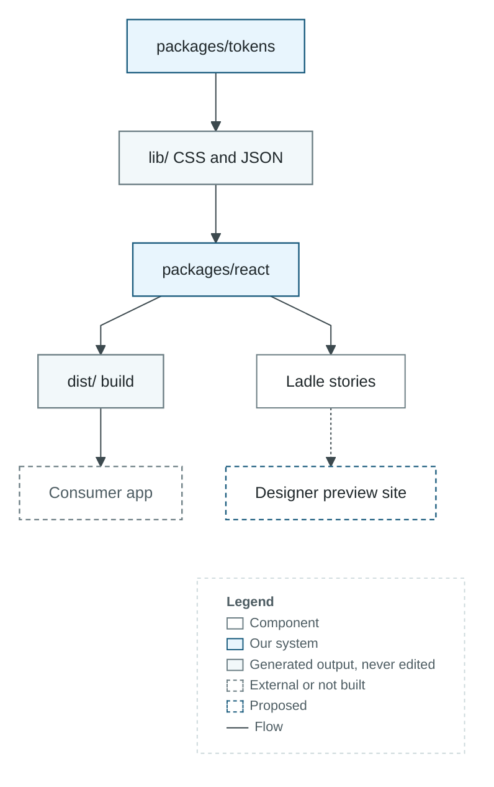

## Flowchart: release critical path (left to right)

```mermaid
%%{init: {"theme":"base","look":"classic","themeVariables":{"fontFamily":"Noto Sans JP, Segoe UI, Yu Gothic UI, Hiragino Sans, system-ui, sans-serif","fontSize":"13px","background":"#FFFFFF","darkMode":false,"useGradient":false,"dropShadow":"none","radius":2,"strokeWidth":1,"primaryColor":"#FFFFFF","primaryBorderColor":"#6C7E84","primaryTextColor":"#20282B","secondaryColor":"#F2F8FA","secondaryBorderColor":"#CDD9DC","secondaryTextColor":"#20282B","tertiaryColor":"#FFFFFF","tertiaryBorderColor":"#CDD9DC","tertiaryTextColor":"#20282B","mainBkg":"#FFFFFF","textColor":"#20282B","titleColor":"#20282B","lineColor":"#3C494E","errorBkgColor":"#FFEEED","errorTextColor":"#94373D","nodeBorder":"#6C7E84","nodeTextColor":"#20282B","clusterBkg":"#F2F8FA","clusterBorder":"#CDD9DC","edgeLabelBackground":"#FFFFFF","defaultLinkColor":"#3C494E","arrowheadColor":"#3C494E","labelBackground":"#FFFFFF"},"fontFamily":"Noto Sans JP, Segoe UI, Yu Gothic UI, Hiragino Sans, system-ui, sans-serif","themeCSS":"&{background-color:#FFFFFF;border-radius:6px;color:#20282B}","flowchart":{"curve":"linear","nodeSpacing":36,"rankSpacing":48,"padding":12,"diagramPadding":16,"htmlLabels":true}}}%%
flowchart LR
  classDef ok fill:#EBF6EC,stroke:#3F7B4A,stroke-width:1.2px,color:#20282B
  classDef warn fill:#FAF1E6,stroke:#826235,stroke-width:1.2px,color:#20282B
  classDef block fill:#FFEEED,stroke:#94373D,stroke-width:1.2px,color:#20282B
  classDef risk fill:#F4F0FD,stroke:#755A9A,stroke-width:1.2px,color:#20282B
  A[Tokens]:::ok --> B[Button]:::warn
  B --> C[Table]:::block
  B --> D[Pagination]:::warn
  C --> E[Pilot launch]:::risk
  D --> E
  %% legend: ok = Ready
  %% legend: warn = Planned this sprint
  %% legend: block = Blocked
  %% legend: risk = Date at risk
  %% legend-start (generated by wairo; edit the %% legend: lines, not this block)
  lg_legend["<div style='text-align:left;font-size:11px;line-height:1.55'><b style='font-weight:600'>Legend</b><br/><span style='display:inline-block;width:12px;height:8px;margin-right:5px;vertical-align:middle;background:rgb(235,246,236);border:1px solid rgb(63,123,74)'></span>Ready<br/><span style='display:inline-block;width:12px;height:8px;margin-right:5px;vertical-align:middle;background:rgb(250,241,230);border:1px solid rgb(130,98,53)'></span>Planned this sprint<br/><span style='display:inline-block;width:12px;height:8px;margin-right:5px;vertical-align:middle;background:rgb(255,238,237);border:1px solid rgb(148,55,61)'></span>Blocked<br/><span style='display:inline-block;width:12px;height:8px;margin-right:5px;vertical-align:middle;background:rgb(244,240,253);border:1px solid rgb(117,90,154)'></span>Date at risk<br/><span style='display:inline-block;width:18px;margin-right:5px;vertical-align:middle;border-top:1px solid rgb(60,73,78)'></span>Flow</div>"]:::lgbox
  E ~~~ lg_legend
  classDef lgbox fill:#FFFFFF,stroke:#CDD9DC,stroke-width:1px,stroke-dasharray:3 3,color:#4E5D63
  %% legend-end
```

## Sequence: consumer install

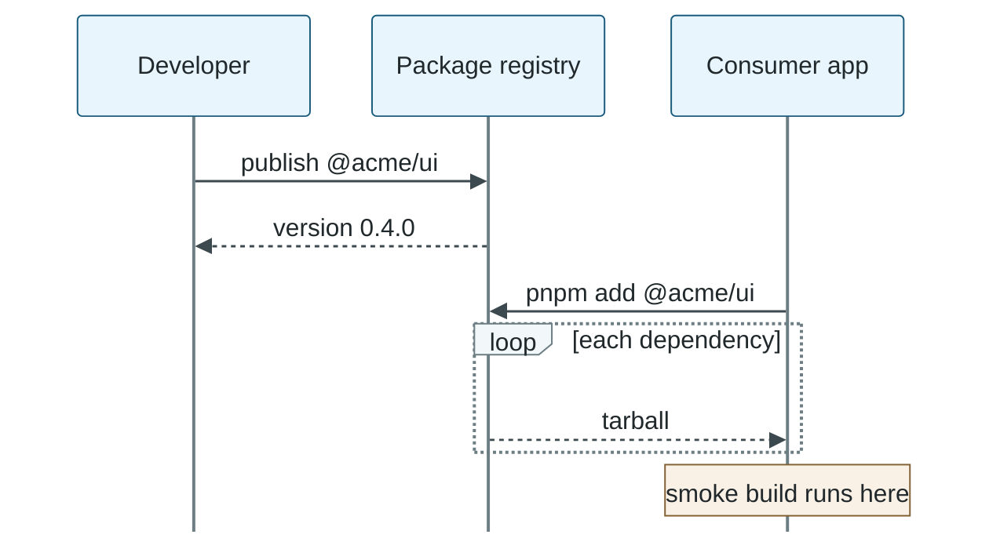
*Legend: solid arrow = call or request; dashed arrow = reply; labelled frame = loop or alternative; ochre note = remark.*

## Gantt: release timeline

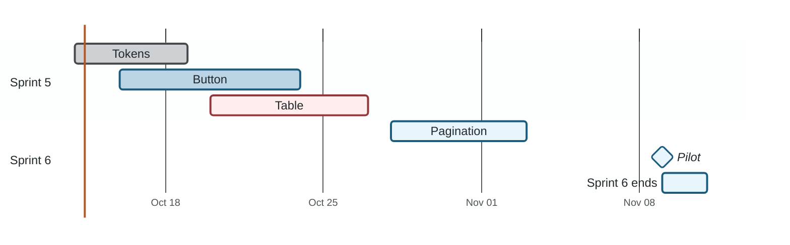
*Legend: pale indigo bar = Planned; indigo bar = In progress; grey bar = Done; crimson-edged bar = Critical path; indigo-edged diamond = Milestone.*

## Pie: test time by area

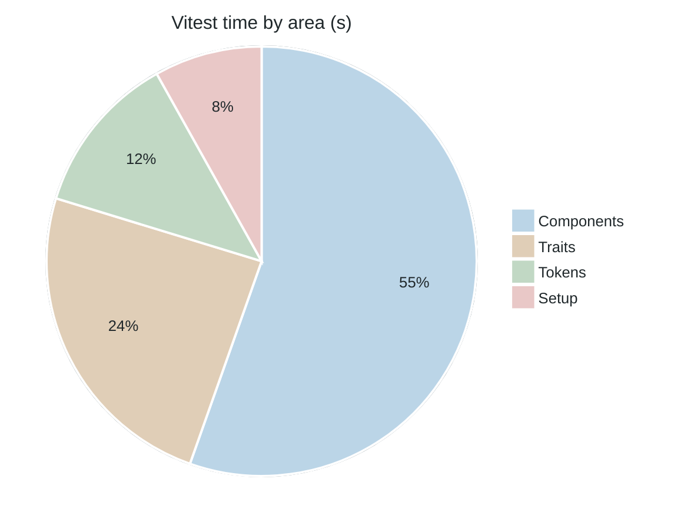

## Quadrant: value and effort

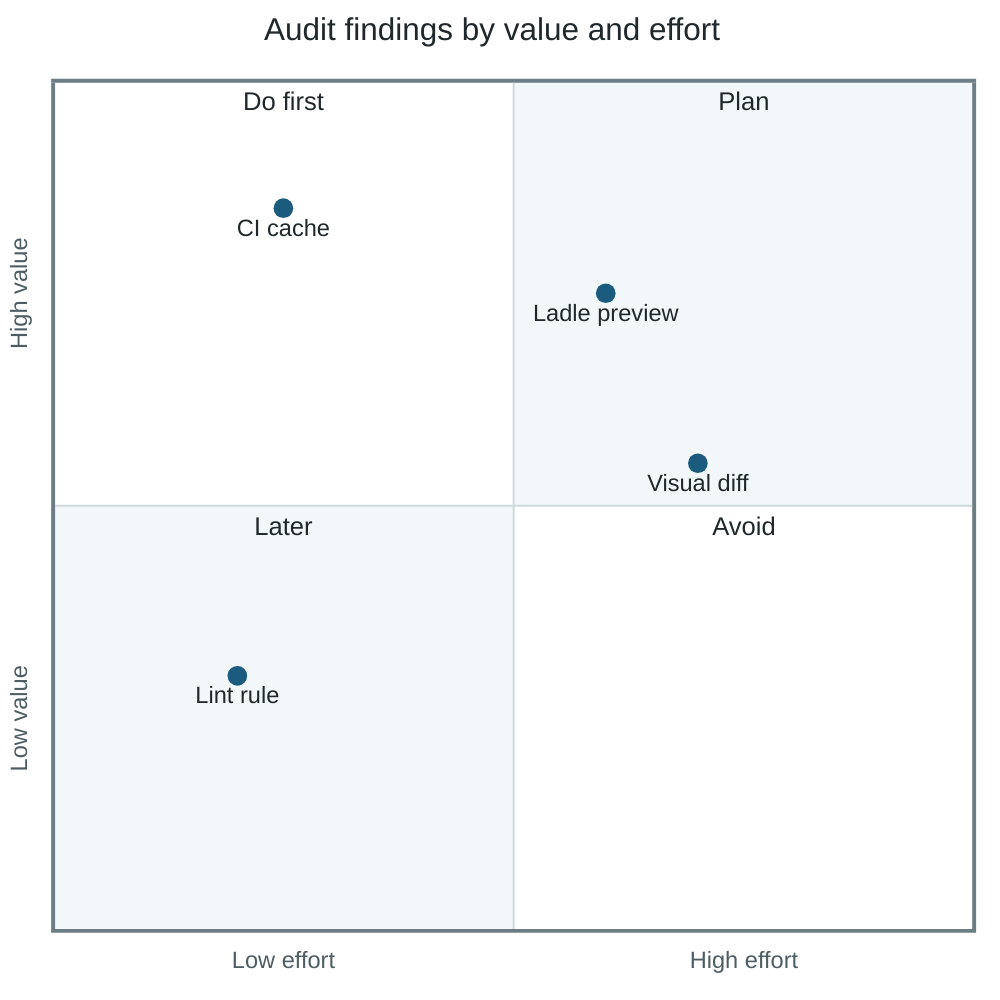
*Legend: each point is one finding, placed by value (up) and effort (right).*

## XY chart: CI step time

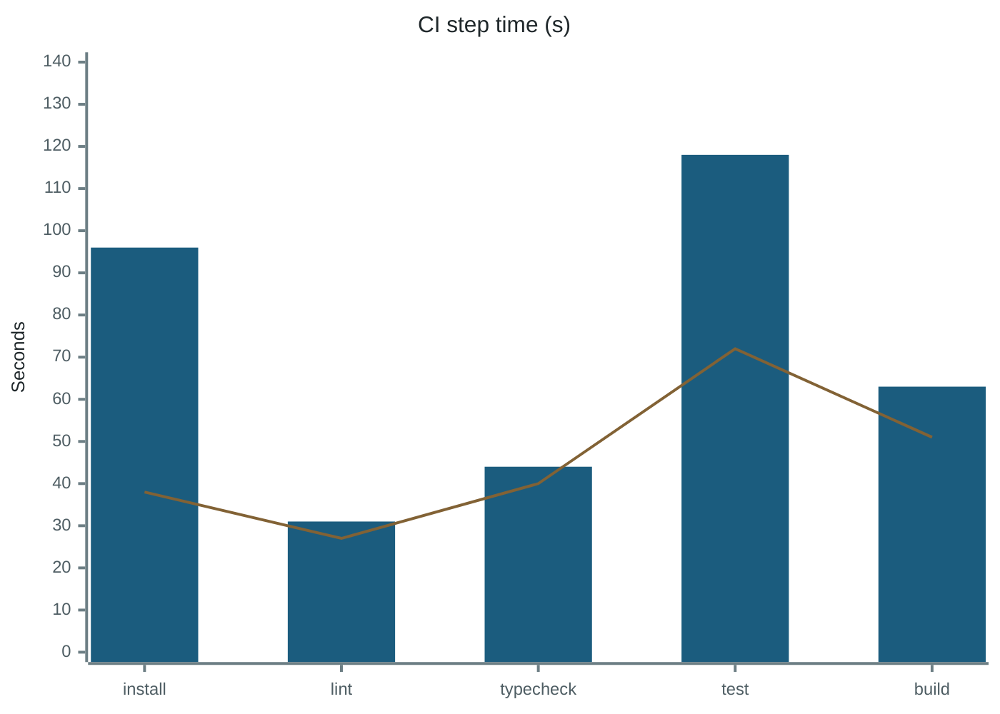
*Legend: indigo series = Before (bars); ochre series = After (lines).*

## Mindmap: architecture

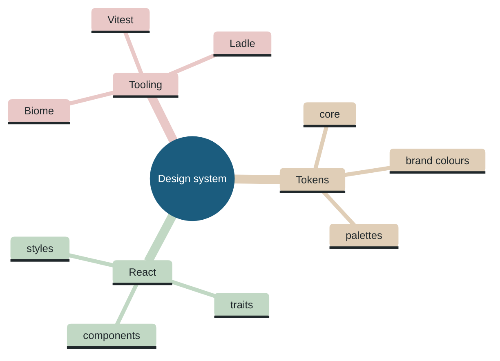
*Legend: ochre band = Tokens; green band = React; crimson band = Tooling.*

## State: pull request

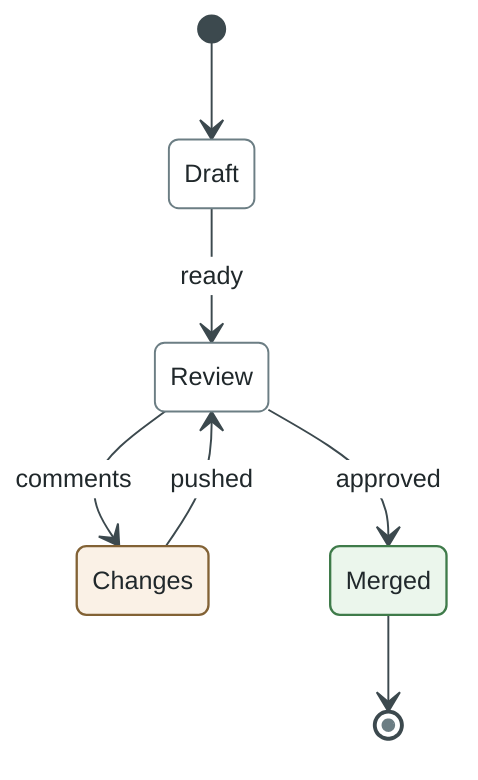
*Legend: green box = Finished; ochre box = Waiting on the author.*

## Class: tokens model

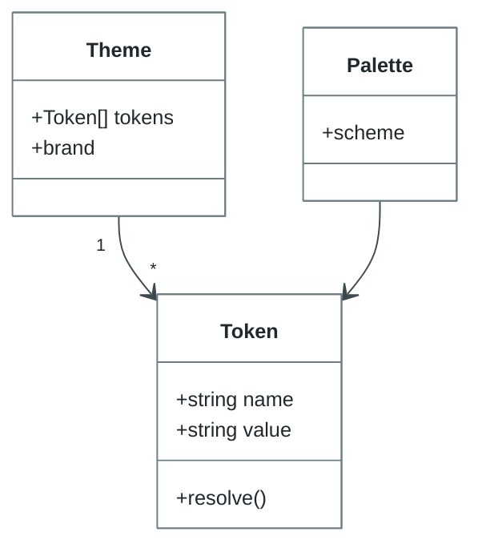
*Legend: boxes are types; arrows point to what a type holds.*

## Entity relationship: releases

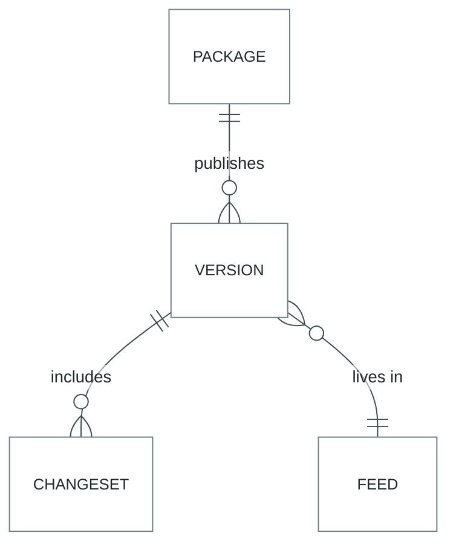
*Legend: crow's feet mark the many side.*

## Git graph: release branch flow

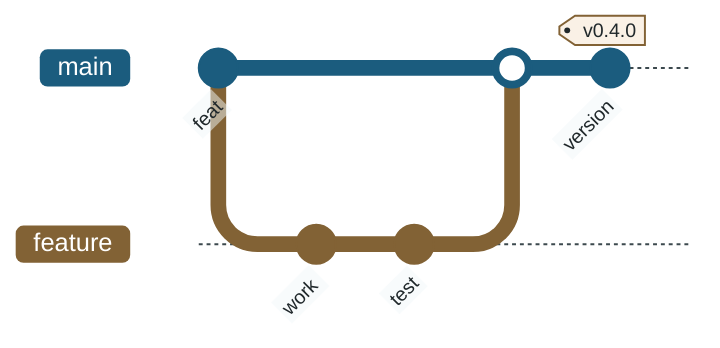
*Legend: each branch has its own colour, named on its line.*

## Types the check refuses

These types can't follow the palette, because Mermaid hard-codes colours that no theme setting reaches:

- **journey**: faces, task borders and section borders are hard-coded greys (#666, #999, #333) in Mermaid's CSS.
- **timeline**: event boxes are drawn 20% brighter than their section colour by Mermaid's CSS, which shifts every hue; use a gantt with milestones.

Not yet proven, so refused until a sample is added here and passes: `C4Component`, `C4Container`, `C4Context`, `architecture-beta`, `block-beta`, `kanban`, `packet-beta`, `radar-beta`, `requirementDiagram`, `treemap-beta`, `venn-beta`.
